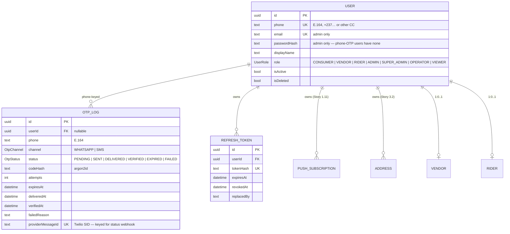

# Data model

Source of truth: [`chopnow-api/prisma/schema.prisma`](https://github.com/ChopNow-app/chopnow-api/blob/develop/prisma/schema.prisma).

This page summarises the entities and how they relate. Open the schema for column types, indexes, and migration history.

## Today (post Story 1.1)

## Planned (lands per Sprint 1–3)

| Entity | Epic | Lands in |
|---|---|---|
| `Address` (PostGIS Point) | E1/E3 | Sprint 1 (Story 3.2 in S2) |
| `Landmark` (PostGIS Point) | E2 | Sprint 1 (Story 2.15) — needs TERRAIN-1 |
| `Vendor` (geo, types: INFORMAL/SEMI_FORMAL/RESTAURANT) | E2 | Sprint 1 (Story 2.0/2.1) |
| `MenuCategory`, `Item` | E2 | Sprint 1 (Story 2.2/2.3) |
| `Rider` (vehicle type, KYC) | E1/E4 | Sprint 1 (Story 1.4) |
| `Order`, `OrderItem`, `OrderStatus` history | E3 | Sprint 2 (Story 3.1) |
| `Payment` (Campay refs, idempotency keys) | E3 | Sprint 2 (Story 3.3/3.4) |
| `Dispatch`, `RiderAssignment`, GPS positions | E4 | Sprint 2 (Story 4.1/4.4) |
| `Rating` (post-delivery) | E3 | Sprint 2 (Story 3.9) |
| `Settlement` (daily livreur/vendor MoMo payouts) | E7 | Sprint 3 (Story 7.1/7.2) |
| `AuditLog` (admin actions, financial movements) | E6/E7 | Sprint 3 |

The schema grows per epic — see `_bmad-output/planning-artifacts/epics/epic-N-*.md` for table-level specs.

## Conventions

- **UUID PKs everywhere.** No auto-increment ints. Prevents enumeration attacks; works for distributed systems if we ever shard.
- **Geo columns** use `Unsupported("geography(Point, 4326)")` in Prisma — managed via raw SQL in migrations. Type-safe access via `$queryRaw` with `ST_AsGeoJSON`.
- **`createdAt` / `updatedAt`** on every table. Prisma `@updatedAt`.
- **Soft delete** (`isDeleted`) only on `User` and the few entities where we need audit trail. Other tables use hard delete (cascade on owning user).
- **Decimal money.** All FCFA amounts stored as `Decimal(10,2)` to dodge floating-point rounding. (Yes, FCFA has no decimals; the precision is for commission rates + intermediate calc.)
- **Unique constraints** on every business identifier (`phone`, `tokenHash`, `(quartier, name)` on Landmark, etc.).
