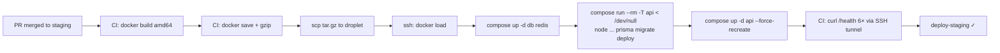
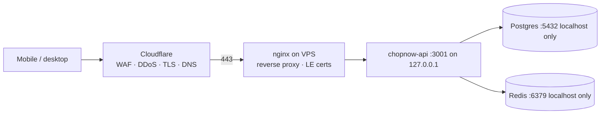

# Infrastructure

Multi-cloud, multi-environment, Terraform-managed. One repo: [`chopnow-infra`](https://github.com/ChopNow-app/chopnow-infra).

## Environments

| Environment | Provider | Server | Cost/month | Lifetime |
|---|---|---|---|---|
| **dev (local)** | your laptop | docker compose (Postgres + Redis + API) | 0 | always |
| **staging** | DigitalOcean | Basic 1 vCPU / 2 GB / 50 GB SSD, Frankfurt, +backups | **~$14.40** | active until **2026-06-26** |
| **production** | Hetzner | CAX11 (2 vCPU Ampere ARM / 4 GB / 40 GB SSD), Falkenstein, +backups | **~€4.55** (~3 100 FCFA) | from late June 2026 |

DO is short-lived; we tear it down (`terraform destroy`) when prod is cut over. Hetzner stays for the long haul.

## Why split staging vs prod cloud

- DigitalOcean **$200 new-account credit** covers the entire 7-week staging window for free.
- Hetzner is **4× cheaper** than DO at our prod size — ~€4 vs ~$17/month for equivalent specs.
- Architectures differ on purpose (x86 staging vs ARM prod) — multi-arch image builds catch portability issues in CI. See [ADR-0004](../decisions/0004-arm64-prod-amd64-staging.md).
- Two providers = two billing emails, two consoles, two SSH keys. Acceptable overhead for the cost gap.

## Cost breakdown (monthly, at scale ~50 cmd/jour)

| Item | FCFA |
|---|---|
| Hetzner CAX11 + backups | **~3 100** |
| Cloudflare R2 (< 10 GB free, scaling) | 0 → 3 000 |
| Vercel frontend | 0 |
| Cloudflare CDN | 0 |
| Sentry, Uptime Kuma (self-hosted) | 0 |
| GitHub Actions CI | 0 (within free 2k minutes) |
| **Subtotal infra serveur** | **~3 100** |
| Twilio (WhatsApp + SMS + Voice) | ~10 000 (MVP) → 60–100k (M9) |
| Campay tx fees | proportional to revenue |
| Domain (tchopnow.app) | ~850 FCFA/an |

Infra is **~3% of total platform charges fixes** (~382 000 FCFA/mois at launch). The cost lever lives in Twilio comms volume, not the servers.

## Provisioning

Everything is in [`chopnow-infra`](https://github.com/ChopNow-app/chopnow-infra) as Terraform. Layout:

```
chopnow-infra/
├── digitalocean/staging/   ← active until 2026-06-26
├── hetzner/production/     ← placeholder, populated end of June 2026
└── aws/_planned/           ← README only; revisit if scale > 1 000 cmd/jour
```

### Bringing up a new env

```bash
cd <provider>/<environment>
export TF_VAR_do_token='dop_v1_…'        # or TF_VAR_hcloud_token for Hetzner
terraform init
terraform plan -out=tfplan
terraform apply tfplan
terraform output droplet_ipv4
```

After provision, the droplet auto-bootstraps via cloud-init (`bootstrap.sh` embedded as `user_data`):

- sshd hardened (no password auth, root by key only)
- `fail2ban` + unattended security upgrades
- Docker Engine + Compose plugin
- `deploy` user (uid 1000) in docker group, with restricted sudo
- 2 GB swapfile (s-1vcpu-2gb has none by default)
- `/opt/chopnow/<env>` ready for the compose stack

State stays **local** (`terraform.tfstate` per env) until we add a second machine that needs to run Terraform. Migration to a remote backend (Terraform Cloud free tier or DO Spaces) is a one-time `terraform init -migrate-state`.

## Deploy flow (per push to `staging` or `main`)



Critical CI quirks learned the hard way (all encoded in `chopnow-api/.github/workflows/ci.yml`):

- `--force-recreate` on api → recovers from previous-deploy crashloops where compose's default `up -d` won't touch a Restarting container
- `-T` AND `</dev/null` on `compose run` → the migration container otherwise eats the rest of the SSH heredoc as stdin, silently truncating the deploy
- amd64 staging vs arm64 prod → multi-stage build covers both; build per arch per target

Image tagging: `chopnow-api:staging-<git-sha>`. No registry yet (gzipped tar over scp) — switching to ghcr.io when we have a second deploy target.

## Network + security topology (planned for prod)



- Cloudflare in front absorbs DDoS + WAF rules (FR-160 in PRD). Direct VPS IP not reachable on 80/443 once we lock the firewall to Cloudflare ranges.
- Postgres and Redis bind to localhost; never exposed publicly.
- API binds to `127.0.0.1:3001`; nginx is the only thing listening on 80/443 from the internet.

## Disaster recovery

| Failure mode | Mitigation | RTO |
|---|---|---|
| API container crashes | `restart: unless-stopped` in compose; alert if crashloop > 5 min | seconds |
| Droplet dies | Hetzner snapshot daily; restore via Terraform + reattach volume | ~30 min |
| Postgres corruption | Hetzner snapshots + manual `pg_dump` cron (planned) | ~1 hour |
| Bad deploy | Re-deploy previous SHA via GitHub Actions `workflow_dispatch` on the prior commit | ~3 min |
| DO token compromised | Rotate via [runbook](../runbooks/rotate-do-token.md); Terraform unaffected | minutes |
| Hetzner SSH key compromised | Regenerate via Terraform `digitalocean_ssh_key` rotation + redeploy | minutes |
