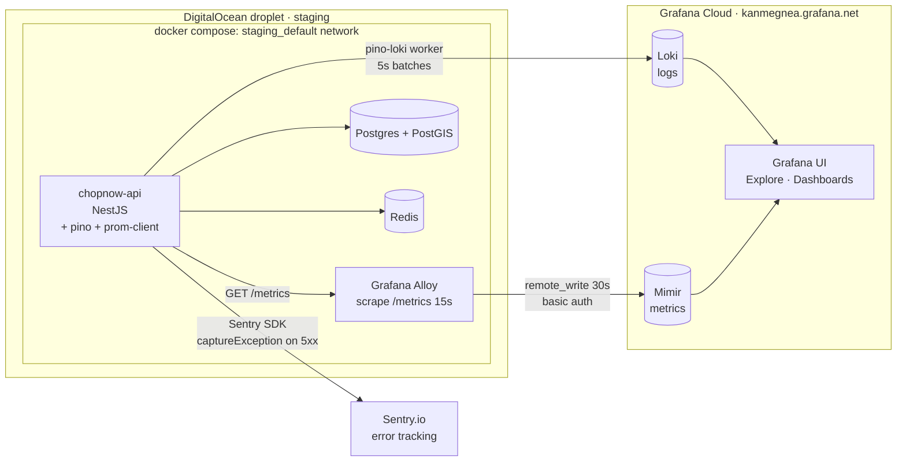

# Observability stack

!!! success "Status — 2026-05-23"
    All seven planned phases shipped and verified end-to-end on staging.
    **Sentry · Loki · Prometheus (via Alloy)** are all receiving production
    data. Activation requires only GitHub environment secrets — every
    component is **inert-by-default** when its secret is unset.

ChopNow's observability stack tracks **errors · logs · metrics · request
latency · failed auth attempts · slow database queries**, with all data
flowing to managed providers on their free tiers.

## High-level diagram



## Components

### 1. Structured logging — `nestjs-pino`

Every HTTP request gets a structured JSON log line (method, path, status,
response time). `PinoLogger` injected into every service for arbitrary
`logger.info({ event: '...', ...}, '…')` events.

- **Event coverage**: ~117 distinct `event:` names across auth, orders,
  payments, dispatch, finance, webhooks, crons. Grep `logger.warn` or
  `logger.error` to enumerate the full set.
- **Redacted automatically**: `req.headers.authorization`,
  `req.headers.cookie` (pino redact rules in `app.module.ts`)
- **Destination**: stdout (JSON in prod, pretty in dev) + Grafana Loki
  when `LOKI_URL` is set
- **Config**: `chopnow-api/src/infra/observability/pino-transport.ts`
  builds the transport target list; `app.module.ts` wires it.

### 2. Loki log shipping

- **Endpoint**: `https://logs-prod-012.grafana.net` (eu-west-2)
- **Labels**: `{ app: 'chopnow-api', env: NODE_ENV }`
- **Auth**: basic auth, tenant `1621923`, token from `LOKI_TOKEN` env var
- **Batching**: 5s interval in a Node worker thread — the main process is
  never blocked by Loki I/O
- **Inert-by-default**: empty `LOKI_URL` ⇒ pino-loki transport not added,
  logs continue to stdout only
- **Verify**: query `{app="chopnow-api"}` in Grafana Explore → should show
  every request + every structured event
- **Secrets**: `STAGING_LOKI_URL`, `STAGING_LOKI_USERNAME`,
  `STAGING_LOKI_TOKEN`

### 3. Sentry error tracking

- **Endpoint**: `https://o4509757894033408.ingest.de.sentry.io`
- **Init**: `chopnow-api/src/infra/observability/sentry.ts` called from
  `main.ts` **before** `NestFactory.create` (must patch http/express
  internals first)
- **What it captures**: every 5xx exception with stack trace + tags
  `{ method, path, status_code }`
- **What it does NOT capture**: 4xx errors (client errors aren't bugs).
  Stack traces NEVER appear in HTTP responses — they go server-to-server
  to Sentry over TLS.
- **Belt-and-braces redaction**: `beforeSend` strips `authorization` /
  `cookie` / `set-cookie` from request breadcrumbs in case Sentry's
  capture path differs from pino's redaction
- **Inert-by-default**: empty `SENTRY_DSN` ⇒ SDK becomes a series of
  empty function calls
- **Verify**: trigger an uncaught 500 → Sentry issue appears within ~60s
- **Secrets**: `STAGING_SENTRY_DSN`. Optional tuning:
  `SENTRY_ENVIRONMENT` (defaults to `NODE_ENV`), `SENTRY_RELEASE` (set
  to `github.sha` in CD), `SENTRY_TRACES_SAMPLE_RATE` (default `0.1`).

### 4. Prometheus metrics endpoint — `GET /metrics`

- **Served by**: `prom-client` default registry; custom controller at
  `VERSION_NEUTRAL` + `@Public()`
- **Default metrics**: Node process (CPU, heap, GC, event loop lag, file
  descriptors)
- **Custom metrics**: `http_request_duration_seconds` histogram, labelled
  `method` × `route_template` × `status`. Buckets cover 10ms → 10s. Route
  *template* (not URL) keeps cardinality bounded — `:orderId` etc. don't
  blow up the series count.
- **Auth**: optional bearer-token gate via `METRICS_AUTH_TOKEN`. Today
  this is **inert on staging** (gate code shipped but no token set). The
  endpoint is still safe because Alloy scrapes via the Docker internal
  network — never over Caddy / the public internet.
- **Verify**: `curl http://api:3001/metrics` from any container in the
  staging compose network

### 5. Prometheus scraping via Grafana Alloy

- **Runs as**: `chopnow-staging-alloy` container in the `staging_default`
  Docker network
- **Scrape config**: `chopnow-api/deploy/alloy/config.alloy` — scrape
  `http://api:3001/metrics` every 15s, label as
  `instance="chopnow-api-staging"`
- **Remote-write target**:
  `https://prometheus-prod-65-prod-eu-west-2.grafana.net/api/prom/push`
- **Auth**: basic auth, tenant `3252496`, **token reuses `STAGING_LOKI_TOKEN`**
  (same Grafana Cloud access policy has both `logs:write` + `metrics:write`
  scopes — no separate secret needed)
- **Cardinality filter**: `write_relabel_config` drops `alloy_*` and `up`
  series — keeps the chopnow-api scrape signal clean
- **Verify**: `prometheus_remote_storage_samples_total` from Alloy's own
  `/metrics` should grow monotonically; `_failed_total` should stay at 0
- **Secrets**: `STAGING_PROM_URL`, `STAGING_PROM_USERNAME`

### 6. Prisma slow-query logging

- **Threshold**: 500ms (env-tunable via `PRISMA_SLOW_QUERY_MS`)
- **Listeners**: `query` (only logged if > threshold), `warn`, `error`
- **Log shape**: `{ event: 'prisma_slow_query', durationMs, query, target }`
  where `query` is the SQL template truncated to 200 chars. Query
  parameters NEVER logged.
- **Config**: `chopnow-api/src/infra/prisma/prisma.service.ts`
- **Recommended**: tighten threshold to 200ms once a steady-state baseline
  is observed in production

### 7. Deep `/ready` probe

- **Liveness `/health`**: process uptime + timestamp. NO external probes
  — Docker healthcheck shouldn't restart the container on a Redis hiccup.
- **Readiness `/ready`**: probes Postgres (`SELECT 1`) + Redis (`PING`) +
  Campay circuit-breaker state. Returns:
    - `200 { status: 'ready', db: 'up', redis: 'up', campay: 'CLOSED' }`
      when all hard deps are healthy
    - `503 { status: 'degraded', db: ..., redis: ..., campay: ... }` on
      any hard-dep failure (so a load balancer drops the instance from
      rotation)
- **Campay state is surfaced for visibility, NOT 503'd on** — Campay
  degradation is business-degradation, not API-down
- **Config**: `chopnow-api/src/health/health.controller.ts`

### 8. OTP failure event

`AuthService.verifyOtp` emits a structured `event: 'otp_verify_failed'`
warning before each 401 path, labelled with the reason
(`no_active_otp` | `max_attempts` | `wrong_code`). This lets a Loki alert
rule detect phone-number enumeration via rapid 401s. See [alert rules
backlog issue #276](https://github.com/ChopNow-app/chopnow-api/issues/276)
for the sketch.

## Free-tier usage envelope

| Resource | Current | Free tier ceiling | Headroom |
| --- | --- | --- | --- |
| Prometheus active series | ~100-200 | 10,000 | 50× |
| Logs ingestion | <100 MB/day at pilot | 1.6 GB/day (50GB/30d) | enormous |
| Sentry events | 0/day pilot | 5,000/month | enormous |
| Card on file | None | — | Hard guarantee: cannot be billed |

!!! info "Trial vs Free"
    Grafana Cloud accounts start on a 14-day Pro trial that auto-downgrades
    to Free at expiry. With no card on file (our current state), Grafana
    literally cannot bill — even if limits are exceeded, the worst case
    is data getting dropped/denied, never a charge.

## Activation matrix

| Service | Code shipped | Active in staging | How to activate |
| --- | --- | --- | --- |
| Sentry error tracking | ✅ | 🟢 | `STAGING_SENTRY_DSN` secret + redeploy |
| Loki log shipping | ✅ | 🟢 | `STAGING_LOKI_URL` + `_USERNAME` + `_TOKEN` |
| Prometheus scraping via Alloy | ✅ | 🟢 | `STAGING_PROM_URL` + `_USERNAME` (reuses Loki token) |
| `/metrics` endpoint | ✅ | 🟢 | (always on) |
| `/metrics` bearer gate | ✅ | 🟡 inert | `STAGING_METRICS_AUTH_TOKEN` if needed |
| Prisma slow-query log | ✅ | 🟢 | (always on, 500ms threshold) |
| Deep `/ready` probe | ✅ | 🟢 | (always on) |
| OTP verify failure event | ✅ | 🟢 | (always on) |

## Configuration files index

All observability code lives under `chopnow-api/`:

| File | Purpose |
| --- | --- |
| `src/infra/observability/sentry.ts` | Sentry SDK init (called from `main.ts`) |
| `src/infra/observability/pino-transport.ts` | Pino → Loki + pino-pretty transport builder |
| `src/infra/observability/metrics.module.ts` + `metrics.controller.ts` | `/metrics` endpoint |
| `src/infra/observability/http-metrics.interceptor.ts` | HTTP request-duration histogram |
| `src/infra/observability/metrics.constants.ts` | Metric DI tokens |
| `src/infra/prisma/prisma.service.ts` | Prisma slow-query listener |
| `src/health/health.controller.ts` | Liveness + deep readiness probes |
| `src/shared/filters/all-exceptions.filter.ts` | 5xx → Sentry + structured log |
| `deploy/alloy/config.alloy` | Alloy scrape + remote-write config |
| `deploy/docker-compose.staging.yml` | Alloy container definition + volume |
| `.github/workflows/cd-staging.yml` | Secret threading + deploy script |

Everything observable lives in code; every secret lives in GitHub
environment secrets (`STAGING_*`). **Nothing manual on the droplet** to
remember or forget.

## Operator tasks

### Searching Loki

LogQL is the query language for Loki. Useful patterns:

```logql
# Every log line in the last hour
{app="chopnow-api"} | json

# Just 5xx responses
{app="chopnow-api"} | json | res_statusCode >= 500

# Refresh-token reuse detection (security signal)
{app="chopnow-api"} |~ "refresh_reuse_detected"

# Slow queries
{app="chopnow-api"} |~ "prisma_slow_query"

# Specific user's recent traffic (filter by userId in pino logs)
{app="chopnow-api"} |~ "userId\":\"<uuid>\""
```

### Rotating a Grafana Cloud token

1. Grafana Cloud → **Security** → **Access Policies** → `chopnow-api-staging-write` → Tokens
2. Click the existing token → **Revoke**
3. Click **Add token** → name it → copy the new value
4. Update the GitHub secret:
   ```bash
   gh secret set STAGING_LOKI_TOKEN --env staging --repo ChopNow-app/chopnow-api
   ```
5. Trigger a redeploy:
   ```bash
   gh workflow run "CD — staging" --ref staging --repo ChopNow-app/chopnow-api
   ```
6. Verify within 5 min: new logs appearing in Loki + Alloy's
   `prometheus_remote_storage_samples_failed_total` stays at 0

### Rotating the Sentry DSN

1. sentry.io → **Settings → Projects → chopnow-api → Client Keys (DSN)**
2. **Revoke** the existing key → **Generate New Key** → copy the new DSN
3. `gh secret set STAGING_SENTRY_DSN --env staging --repo ChopNow-app/chopnow-api`
4. Redeploy
5. Force a 500 → verify new event appears in Sentry

### Diagnosing "metrics not flowing"

When a Grafana Explore query returns "No data":

```bash
# 1. Confirm alloy container is up
ssh root@157.230.125.224 'docker ps | grep alloy'

# 2. Confirm scrape succeeded recently
ssh root@157.230.125.224 'docker run --rm --network staging_default curlimages/curl \
  -sS http://alloy:12345/api/v0/web/components/prometheus.scrape.api' | jq

# Look for: health.state == "healthy" + last_scrape within last 30s

# 3. Check Alloy's own counters
ssh root@157.230.125.224 'docker run --rm --network staging_default curlimages/curl \
  -sS http://alloy:12345/metrics' | grep remote_storage_samples

# samples_total should grow; samples_failed_total should stay 0

# 4. If samples_failed is non-zero, scope the error
ssh root@157.230.125.224 'docker logs chopnow-staging-alloy --since 10m | \
  grep -iE "error|fail|401|429|5[0-9][0-9]"'
```

## Backlog — tracked issues

Items deliberately not built yet, each with a "trigger to revisit"
condition in its issue body:

| Issue | Item | Revisit when |
| --- | --- | --- |
| [chopnow-api#274](https://github.com/ChopNow-app/chopnow-api/issues/274) | Custom business counters (orders, payments, queue depth, riders online) | Before pilot launch |
| [chopnow-api#275](https://github.com/ChopNow-app/chopnow-api/issues/275) | Grafana dashboards (RED + business + auth-abuse + infra) | After 5-7 days of pilot data |
| [chopnow-api#276](https://github.com/ChopNow-app/chopnow-api/issues/276) | Alert rules | After dashboards (need baseline) |
| [chopnow-api#277](https://github.com/ChopNow-app/chopnow-api/issues/277) | Distributed tracing via Tempo + OpenTelemetry | Post-pilot / hard-to-debug incident |
| [chopnow-api#278](https://github.com/ChopNow-app/chopnow-api/issues/278) | Continuous profiling via Pyroscope | After tracing lands |
| [chopnow-api#279](https://github.com/ChopNow-app/chopnow-api/issues/279) | Alert routing beyond email (Slack / Discord / WhatsApp) | After alert rules; before team > 1 |

### Adjacent backlog

Infrastructure-scale-up items that aren't strictly observability but live
in the same "what we don't need yet, but should remember" bucket:

| Issue | Item | Revisit when |
| --- | --- | --- |
| [chopnow-api#280](https://github.com/ChopNow-app/chopnow-api/issues/280) | Postgres `tsvector` + `pg_trgm` for catalogue search (deferred Elasticsearch evaluation) | Vendor count > 50, item count > 500, or search-driven discovery overtakes category browse |

## Related docs

- [Infrastructure overview](infrastructure.md) — droplet layout, Caddy, R2
- [Security](security.md) — auth model, secret management
- [Deploy to staging](../runbooks/deploy-staging.md) — how the CD workflow ships changes
