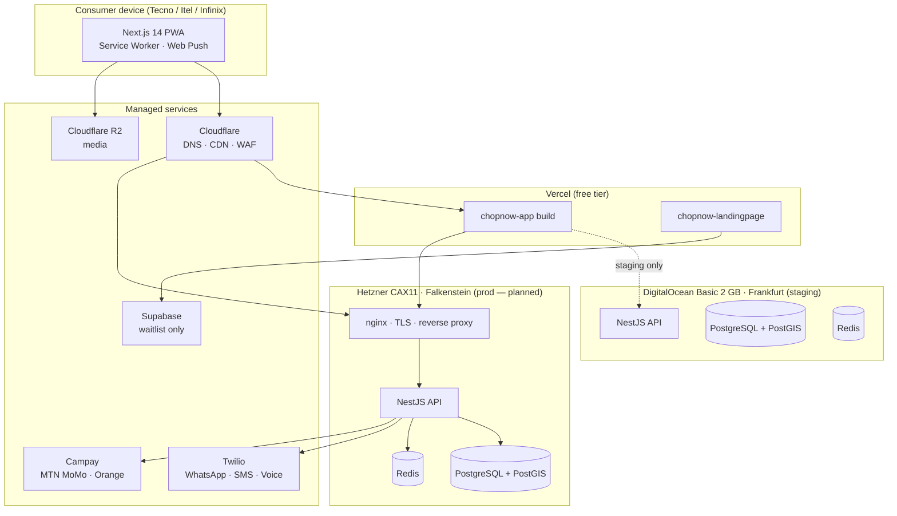
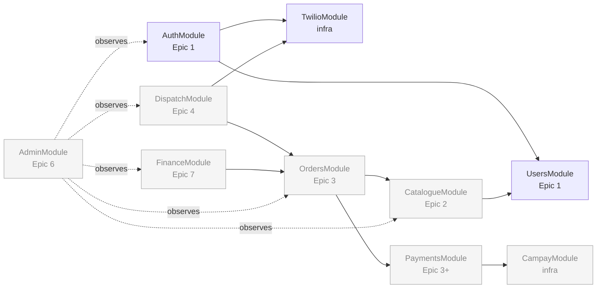
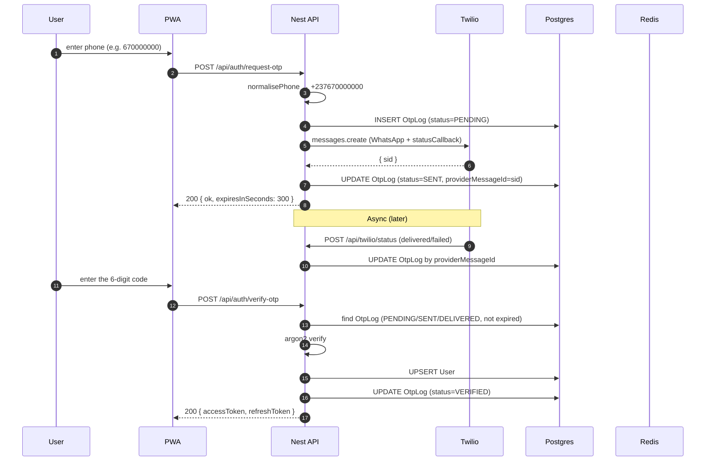

# Architecture overview

One backend, one frontend, two managed providers, two cloud hosts. Optimised for solo-dev maintenance and per-order unit economics.

## High-level diagram

## Module map (chopnow-api)

Modules align with Epics in the PRD. Each domain module owns its database tables; cross-module reactions go through domain events, never direct service calls.

Today (post Story 1.1):

- ✅ AuthModule, UsersModule, TwilioModule, HealthModule
- ⏳ Everything else lands per Sprint 1–3 in `sprint-status.yaml`

## Request → response anatomy (signup example)

## Why this shape

| Concern | Decision | See |
|---|---|---|
| Single VPS until 2 000 cmd/jour | One Hetzner box, Postgres + Redis colocated. Predictable cost, simple ops. | [ADR-0003](../decisions/0003-hetzner-not-aws.md) |
| PWA, not native | Wakelock API validated on Android Tecno/Itel. No app-store friction. | [ADR-0001](../decisions/0001-pwa-not-react-native.md) |
| Twilio for comms | Unified WhatsApp + SMS + Voice SDK. Skips 15-day Meta verification. | [ADR-0002](../decisions/0002-twilio-not-africas-talking.md) |
| ARM in prod, x86 in staging | Hetzner CAX11 (Ampere ARM) is 20% cheaper. DO basic is x86. | [ADR-0004](../decisions/0004-arm64-prod-amd64-staging.md) |
| Cloudflare R2 for media | Zero egress cost. S3-compatible API. | architecture.md |
| Vercel for frontend | Free tier, atomic deploys, instant rollback. | architecture.md |
