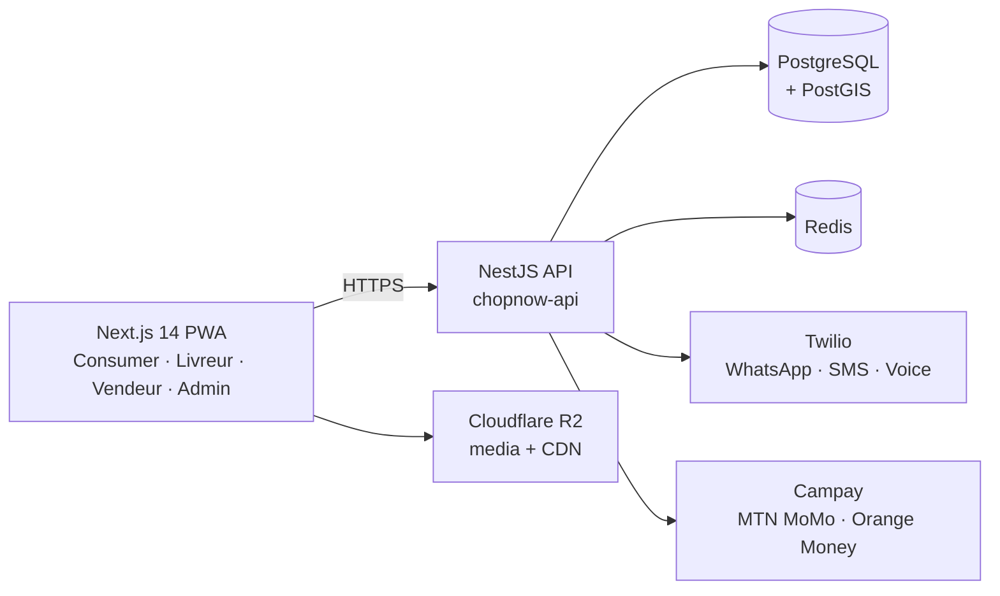

# Overview

## What ChopNow is

A food-delivery PWA targeting Douala first, scaling across Cameroon. Three actor types share the same codebase via different routes:

- **Consumer** — orders food, pays cash or MoMo (MTN, Orange), tracks the rider in real time
- **Vendeur** (vendor) — informal cuisinier, semi-formal maquis, or formal restaurant. Manages menu + availability
- **Livreur** (rider) — accepts dispatched orders, navigates with GPS, marks pickup + delivery, gets paid daily by MoMo

A fourth surface — **Admin** — is internal: validate vendors, suspend bad actors, monitor SLA, reconcile finance.

## Why a PWA and not native apps

Validated as part of POC-3 (2026-04-13): the Wakelock API on Android Chrome keeps GPS active for >10 minutes on real Tecno + Itel devices, which is the bottleneck native apps usually solve. Going PWA removes the app-store friction (no 7-day review cycle, no install funnel drop-off) and unifies the code into one Next.js app.

Cancelled stories along this line: `epic-5-whatsapp-bot` (PWA covers the same UX without bot UX limits).

## Stack snapshot

| Layer | Tech | Why |
|---|---|---|
| Frontend | Next.js 14 (App Router), Tailwind, Mapbox GL JS | Same code for all four actors via routing |
| Backend | NestJS 11, TypeScript, Prisma 6, Joi | Module boundaries match Epics; OpenAPI auto-generated |
| Database | PostgreSQL 16 + PostGIS 3.4 | Geo queries for dispatch, single DB for the whole MVP |
| Cache + queue | Redis 7, BullMQ | Rate limiting, OTP TTL, background jobs |
| OTP | Twilio WhatsApp + SMS fallback | Unified SDK, validated POC-2 |
| Payments | Campay (MTN + Orange Money) | Single integration for both telcos |
| Voice (rider↔client) | Twilio Voice TwiML Dial bridge | Number masking, ~$0.12/min |
| Media | Cloudflare R2 + Sharp | Zero egress cost |
| Hosting | Hetzner CAX11 (prod) · DigitalOcean (staging) | Cost-optimised, validated against AWS |

See [Stack rationale](../architecture/stack.md) and [Infrastructure](../architecture/infrastructure.md) for the full why.

## Business model in one paragraph

Margin per order (blended): **303 FCFA**. Charges fixes at launch: **~382 000 FCFA/mois**. Break-even at **~42 cmd/jour**. The infra serveur itself is **~3% of charges** (~3 000 FCFA/mois) — Hetzner CAX11 + backups. Twilio comms scale with volume (~10 000 → 60 000 FCFA/mois). Full numbers in `_bmad-output/planning-artifacts/business-model.md`.

## What's live today

| | |
|---|---|
| Story 1.1 — OTP signup (consumer) | ✅ on `develop`, deployed to staging |
| Staging environment | ✅ `http://157.230.125.224:3001/health` |
| CI tiered (push / PR-develop / PR-staging / PR-main) | ✅ |
| Production environment | ⏳ Hetzner CAX11 — provision end of June 2026 |
| Story 1.2 — Reconnexion (refresh tokens) | next |

Sprint 1 is in progress. Authoritative state in `_bmad-output/implementation-artifacts/sprint-status.yaml`.
