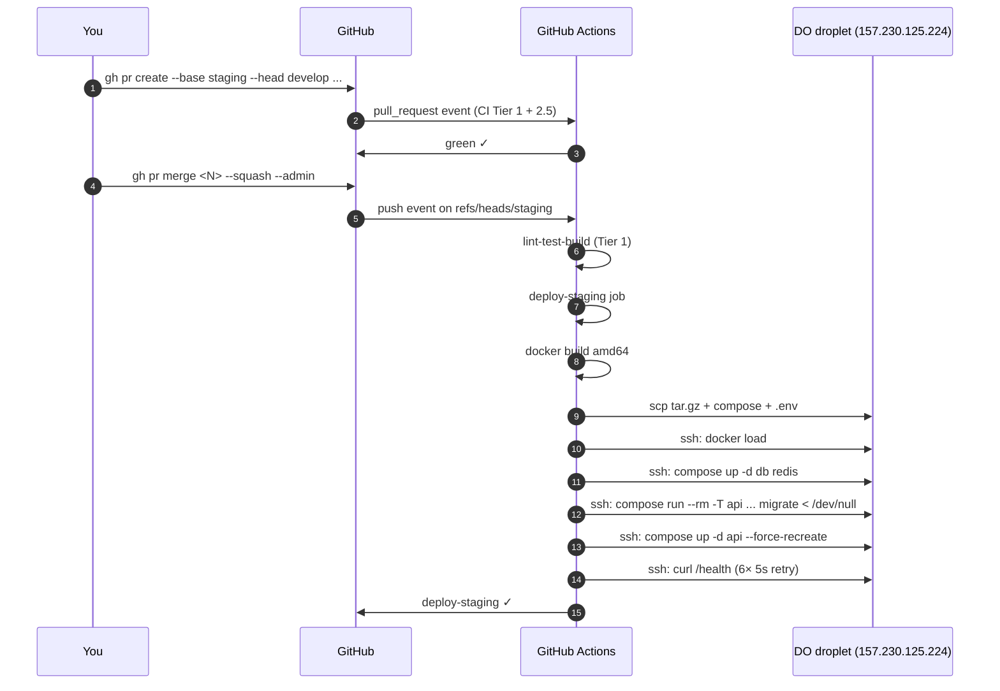

# Deploy to staging

## When to use

You merged a PR to `develop` and want to promote it to staging, OR you just merged a `develop → staging` PR and want to watch the auto-deploy run.

## Automated flow (the normal case)



### Steps

1. Have the `develop → staging` PR ready (`gh pr list --base staging`).
2. Check CI is green: `gh pr checks <N>`.
3. **Important**: use squash merge, no delete-branch on a trunk:
   ```
   gh pr merge <N> --squash --admin
   ```
4. Watch the deploy: `gh run watch` or `gh run list --workflow=ci.yml --branch=staging --limit=1`.
5. Verify live: `ssh -i ~/.ssh/do_ed25519 root@157.230.125.224 'curl -s http://localhost:3001/health'`.

## Manual deploy (CI unavailable)

If GitHub Actions is down, deploy manually from your machine:

```bash
cd ~/Desktop/Business/ChopNow/chopnow-api
# 1. Build for staging arch
docker build -t chopnow-api:staging-$(git rev-parse HEAD) .

# 2. Save + transfer
docker save chopnow-api:staging-$(git rev-parse HEAD) | gzip > /tmp/img.tar.gz
scp -i ~/.ssh/do_ed25519 /tmp/img.tar.gz root@157.230.125.224:/opt/chopnow/staging/image.tar.gz
scp -i ~/.ssh/do_ed25519 deploy/docker-compose.staging.yml root@157.230.125.224:/opt/chopnow/staging/docker-compose.yml

# 3. Update .env (manually — pull secrets from `gh secret list --env staging`)
# Skipped here; see deploy/.env.staging.example for shape

# 4. Deploy
ssh -i ~/.ssh/do_ed25519 deploy@157.230.125.224 'bash -s' <<'EOF'
set -euo pipefail
cd /opt/chopnow/staging
gunzip -c image.tar.gz | docker load
docker compose up -d db redis
docker compose run --rm -T api node node_modules/prisma/build/index.js migrate deploy < /dev/null
docker compose up -d api --force-recreate --remove-orphans
docker compose ps
EOF

# 5. Verify
ssh deploy@157.230.125.224 'curl -s http://localhost:3001/health'
```

## Verification

| Check | Pass criteria |
|---|---|
| `curl http://localhost:3001/health` (via SSH) | `{"status":"ok","uptime":<small>,...}` — uptime < 60s means a fresh container |
| `docker compose ps` | api row shows the SHA you just deployed in the IMAGE column |
| `docker compose logs api --tail=20` | "Nest application successfully started" near the end |

## What to do if it fails

| Symptom | Likely cause | Fix |
|---|---|---|
| Build step fails | `Dockerfile` regression | Check the build log; reproduce locally with `docker build .` |
| `scp` fails | SSH key issue OR droplet down | Re-check `STAGING_SSH_KEY` secret; ping the IP |
| `docker load` fails on droplet | Image corruption mid-transfer | Re-run the deploy; if persistent, try smaller image |
| `migrate deploy` fails | Schema mismatch; ask author of the migration | Logs in the deploy step; may need a manual `prisma migrate resolve` |
| Health check fails after 6 retries | API crashloop | Pulled automatically by the workflow (`docker compose logs api --tail=50`); read for the actual error |
| Container stuck on OLD image | `--force-recreate` not running (pre-PR #113 deploys had this bug, fixed) | Manual: `ssh deploy@<host>` then `cd /opt/chopnow/staging && docker compose up -d api --force-recreate --remove-orphans` |
