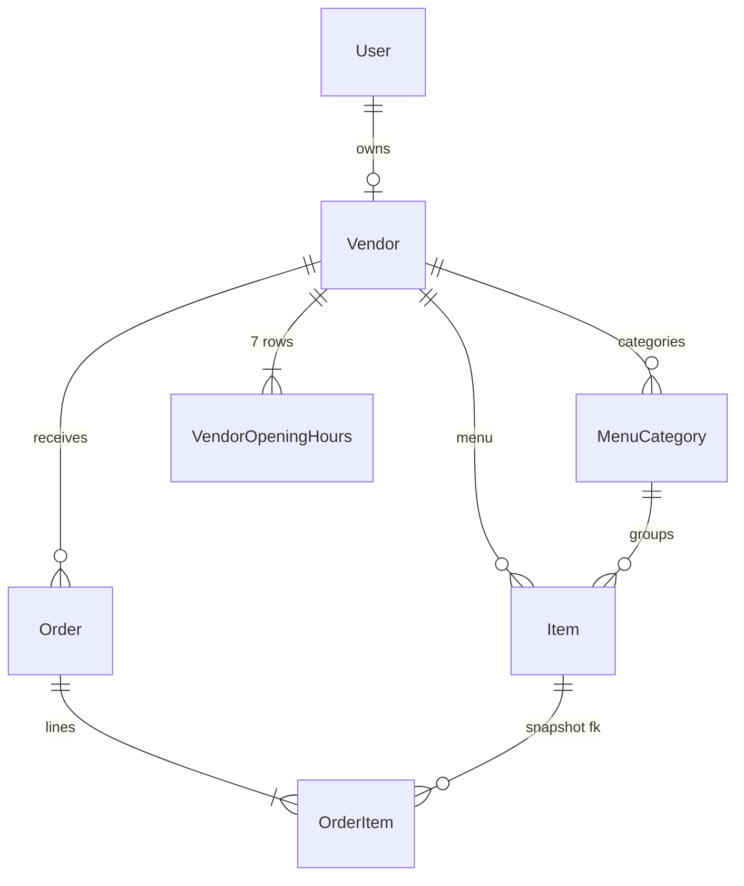

# Data model

The Prisma models that constitute the vendor's footprint in the database. Source of truth: `chopnow-api/prisma/schema.prisma`.

## `Vendor`

The cook. 1:1 with `User` (the auth identity).

```prisma
model Vendor {
  id                String         @id @default(uuid())
  userId            String         @unique
  user              User           @relation(fields: [userId], references: [id], onDelete: Cascade)

  // Identity
  type              VendorType     // INFORMAL | SEMI_FORMAL | RESTAURANT
  status            VendorStatus   @default(PENDING_REVIEW)
  name              String
  description       String?

  // Phones
  whatsappPhone     String         // OTP + notifications
  momoPhone         String         // MoMo payout destination

  // KYC — RESTAURANT only
  ownerName         String?
  rccm              String?
  niu               String?
  enseignePhotoUrl  String?

  // Location
  quartier          String         // "Bonamoussadi", "Makepe", …
  landmark          String?
  location          Unsupported("geography(Point, 4326)")  // PostGIS column

  // Catalogue
  profilePhotoUrl   String?
  coverPhotoUrl     String?
  isOpen            Boolean        @default(false)         // manual on/off switch

  // Capacity declaration (semi-formal / restaurant)
  declaredCapacity  Int?           // orders/hour

  // Relations
  items             Item[]
  menuCategories    MenuCategory[]
  hours             VendorOpeningHours[]
  orders            Order[]

  // Audit
  submittedAt       DateTime       @default(now())
  approvedAt        DateTime?
  rejectedAt        DateTime?
  rejectionReason   String?
  createdAt         DateTime       @default(now())
  updatedAt         DateTime       @updatedAt
}
```

### Enums

```prisma
enum VendorType {
  INFORMAL
  SEMI_FORMAL
  RESTAURANT
}

enum VendorStatus {
  PENDING_REVIEW         // submitted, awaiting admin
  ACTIVE                 // approved, can take orders
  REJECTED               // admin rejected
  CORRECTION_REQUESTED   // admin asked for revisions
  SUSPENDED              // admin pulled offline (account compromised, fraud, etc.)
}
```

### Indexes that matter

- `User.phone` is `@unique` — one phone, one user, regardless of role.
- `Vendor.userId` is `@unique` — one user, one vendor.
- `Vendor.location` has a GiST index for PostGIS distance ranking (`ST_DWithin` queries in `DispatchService` + the consumer catalogue's "near me" sort).

## `Item`

A dish or drink on the vendor's menu.

```prisma
model Item {
  id                 String        @id @default(uuid())
  vendorId           String
  vendor             Vendor        @relation(fields: [vendorId], references: [id], onDelete: Cascade)
  categoryId         String?
  category           MenuCategory? @relation(fields: [categoryId], references: [id], onDelete: SetNull)

  name               String
  description        String?
  priceXAF           Int           // integer FCFA, no decimals (smallest unit on Cameroon market is 5 FCFA)
  photoUrl           String?

  isAvailable        Boolean       @default(true)     // vendor on/off
  isInStock          Boolean       @default(true)     // derived from stockLevel; legacy paths still read this
  stockLevel         StockLevel    @default(IN_STOCK)  // OUT_OF_STOCK | LOW_STOCK | IN_STOCK
  kind               ItemKind      @default(FOOD)      // FOOD | DRINK
  preparationMinutes Int?          // avg prep, used by dispatch ETA
  sortOrder          Int           @default(0)

  orderItems         OrderItem[]   // historic snapshot rows on orders

  createdAt          DateTime      @default(now())
  updatedAt          DateTime      @updatedAt
}
```

Key invariant: `OrderItem` snapshots `name` and `priceXAF` at order creation time. Editing the live `Item` later **does not** change historic order values — a 4000 FCFA Ndolé stays a 4000 FCFA Ndolé on every order placed before the price changed.

## `MenuCategory`

A vendor-defined grouping shown as tabs in `/vendor/menu` and on the consumer's vendor detail page.

```prisma
model MenuCategory {
  id        String  @id @default(uuid())
  vendorId  String
  vendor    Vendor  @relation(fields: [vendorId], references: [id], onDelete: Cascade)
  name      String  // "Plats", "Boissons", "Petit déj"
  sortOrder Int     @default(0)
  items     Item[]

  @@unique([vendorId, name])     // a vendor can't have two categories with the same name
}
```

## `VendorOpeningHours`

Seven rows per vendor, one per weekday. The frontend editor at `/vendor/hours` replaces the whole array on each save.

```prisma
model VendorOpeningHours {
  id        String  @id @default(uuid())
  vendorId  String
  vendor    Vendor  @relation(fields: [vendorId], references: [id], onDelete: Cascade)
  dayOfWeek Int     // 0 = Sunday … 6 = Saturday
  isOpen    Boolean @default(false)
  openTime  String? // "08:00" — HH:MM 24h
  closeTime String? // "22:00"

  @@unique([vendorId, dayOfWeek])
}
```

`isOpenNow` is computed by combining `Vendor.isOpen` (manual switch) AND the row matching `dayOfWeek === today` falling within `[openTime, closeTime]`. Either being false makes the vendor invisible in the catalogue.

## `Order` (vendor-relevant columns)

The full `Order` model is documented in [`architecture/data-model`](../architecture/data-model.md). The columns the vendor surface reads:

```prisma
model Order {
  id                   String        @id @default(uuid())
  code                 String        @unique               // "TC-A23F4" — 5-char human-friendly
  vendorId             String
  userId               String                              // consumer
  riderId              String?

  status               OrderStatus
  paymentStatus        PaymentStatus
  paymentMethod        PaymentMethod  // MTN_MOMO | ORANGE_MONEY (+ deprecated CASH)
  subtotalXAF          Int
  deliveryFeeXAF       Int
  totalXAF             Int
  noteForVendor        String?

  pickupCode           String         // 4-digit, vendor → rider
  deliveryCode         String         // 4-digit, consumer → rider (vendor never reads)

  acceptanceDeadlineAt DateTime?      // SET at payment confirmation, not creation
  placedAt             DateTime       @default(now())
  paidAt               DateTime?
  acceptedAt           DateTime?
  refusedAt            DateTime?
  refusalReason        String?
  preparedAt           DateTime?
  pickedUpAt           DateTime?
  deliveredAt          DateTime?

  items                OrderItem[]
}
```

### `OrderStatus` enum

```prisma
enum OrderStatus {
  PENDING        // newly created — payment may or may not have started
  CONFIRMED      // payment confirmed (paymentStatus=PAID); ready for vendor decision
  ACCEPTED       // vendor accepted
  IN_PREP        // first item marked prepared
  READY_PICKUP   // every item prepared, vendor confirmed
  PICKED_UP      // rider scanned pickup code
  DELIVERED      // rider scanned delivery code
  REFUSED        // vendor refused OR cron auto-refused
  CANCELLED      // consumer cancelled (before vendor acceptance)
  EXPIRED        // no rider found after 10 retries
}
```

### `OrderItem` (line items)

```prisma
model OrderItem {
  id               String   @id @default(uuid())
  orderId          String
  order            Order    @relation(fields: [orderId], references: [id], onDelete: Cascade)
  itemId           String?
  item             Item?    @relation(fields: [itemId], references: [id], onDelete: SetNull)

  nameSnapshot     String   // captured at order creation — survives renames
  priceXAFSnapshot Int      // captured at order creation — survives price changes
  quantity         Int
  lineXAF          Int      // priceXAFSnapshot * quantity, denormalised for read perf

  preparedAt       DateTime? // null = pending; set when vendor marks prepared
}
```

`itemId` is nullable so an item deletion doesn't cascade-destroy historic order line items. The snapshot fields preserve everything the consumer needs to see on `/orders/[id]`.

## Relational summary


