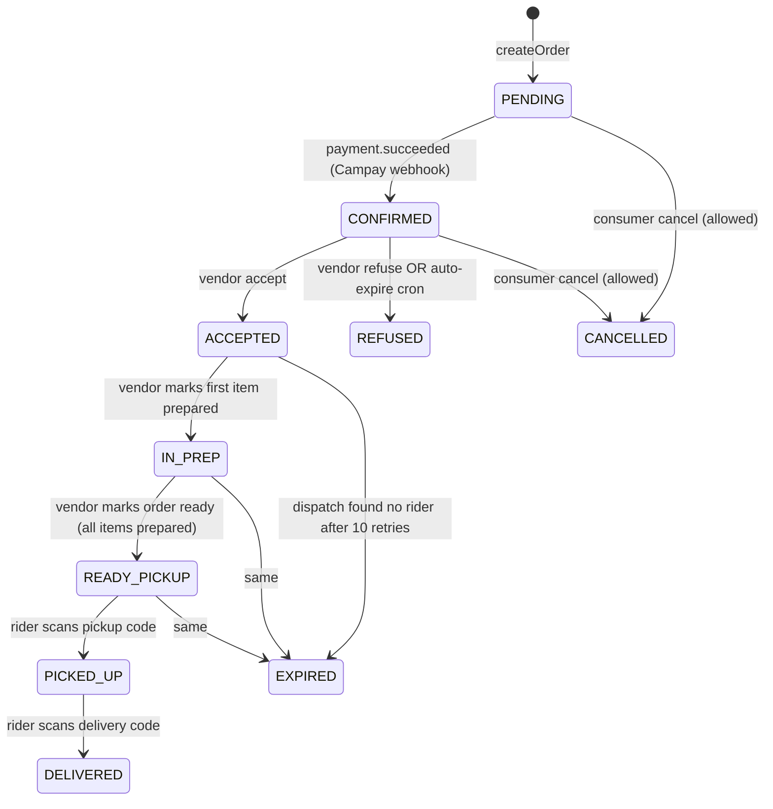

# Order lifecycle (vendor view)

The vendor sees an order at three points: when it arrives (Decision), while preparing (Preparation), and at handover (Ready/Picked-up). Everything before and after is invisible to them by design.

## Status machine



The `OrderStatus` enum is defined in `prisma/schema.prisma`. The transition guards are explicit `ReadonlySet`s at the top of `OrdersService`:

```ts
const VENDOR_CAN_DECIDE = new Set([OrderStatus.PENDING, OrderStatus.CONFIRMED]);
const CONSUMER_CAN_CANCEL = new Set([OrderStatus.PENDING, OrderStatus.CONFIRMED]);
```

## What the vendor actually sees

**Critically, the vendor never sees a `PENDING` order.** The platform is MoMo-only — `paymentStatus=PENDING` means the consumer is mid-USSD-flow or has walked away. Showing those orders to the vendor would:

1. Burn the 60s acceptance countdown on an order that might never pay.
2. Generate a "no-show" pattern when consumers abandon carts → unfair to vendor metrics.
3. Cause the cron to auto-refuse before the consumer's MoMo confirms → vendor never gets the order.

So `listVendorOrders` at `orders.service.ts:291` filters on `paymentStatus: PaymentStatus.PAID` — only orders the Campay webhook has confirmed are eligible to surface.

When `onPaymentSucceeded` (`orders.service.ts:573`) fires, it does four things atomically:

1. Sets `status=CONFIRMED`, `paymentStatus=PAID`, `paidAt=now`.
2. Sets `acceptanceDeadlineAt = now + 60s` — countdown starts here, **not** at order creation.
3. Emits `DomainEvents.ORDER_PAID` (accounting).
4. Emits `DomainEvents.ORDER_CREATED` → triggers the vendor push (see [notifications](notifications.md)).

This is the **payment-gated visibility model** introduced in PR #178 / #179. The reasoning:

> *Without it, a consumer who walks away mid-MoMo would burn a vendor's acceptance countdown for an unpaid order.*

## The 60-second decision window

When `ORDER_CREATED` fires from the webhook handler:

1. Vendor's PWA receives Web Push → tap → `/vendor/commande/[orderId]`.
2. If the dashboard is foregrounded: SW `postMessage` → in-app chime + auto-reload of the orders list.
3. The countdown screen renders the absolute deadline (`acceptanceDeadlineAt`), not a from-now timer — so a tab reload preserves the remaining seconds.
4. Vendor taps **Accept** or **Refuse**.

Two things can race here:

- **The auto-refuse cron** (`OrdersExpiryService.sweepExpired`, runs every 10s) — flips PENDING/CONFIRMED orders past their deadline to REFUSED.
- **The consumer cancel button** — `cancelOrder` route allows cancel up to vendor acceptance.

Both are guarded; see [concurrency](concurrency.md).

## Accept path

```
PATCH /api/orders/:id/accept              OrdersController → OrdersService.acceptOrder
```

```ts
// orders.service.ts:309
async acceptOrder(orderId: string, userId: string) {
  const order = await this.requireVendorOrder(orderId, userId);
  if (!VENDOR_CAN_DECIDE.has(order.status)) {
    throw new ConflictException({ code: 'order_not_pending', ... });
  }
  const res = await this.prisma.order.updateMany({
    where: { id: order.id, status: { in: [PENDING, CONFIRMED] } },
    data: { status: OrderStatus.ACCEPTED, acceptedAt: now },
  });
  if (res.count === 0) {
    throw new ConflictException({ code: 'order_state_changed', ... });
  }
  this.events.emit(DomainEvents.ORDER_ACCEPTED, { orderId, vendorId, acceptedAt });
  return this.prisma.order.findUnique({ where: { id: order.id } });
}
```

Three failure modes:

| Code | Cause | UX |
|---|---|---|
| `order_not_found` | Order belongs to a different vendor | 404 (never enumerate) |
| `order_not_pending` | Stale URL — order already decided | "This order has already been decided" |
| `order_state_changed` | Sub-100ms race — cron auto-refused between read and write | "This order just expired — refresh" |

`refuseOrder` is symmetric, with an additional `RefusalReason` enum body field.

## Preparation

After acceptance, the order has line-items. The vendor marks each as prepared from `/vendor/preparation/[orderId]`:

```
PATCH /api/orders/:id/items/:itemId/prepared    OrdersService.markItemPrepared
```

Service-side, marking the **first** item flips the order from `ACCEPTED → IN_PREP`. Marking the **last** item does **not** auto-flip to `READY_PICKUP` — the vendor explicitly confirms via:

```
PATCH /api/orders/:id/ready                     OrdersService.markOrderReady
```

This is deliberate. The vendor might finish the last dish then realise they're short on packaging; they need a beat to confirm "yes, this is leaving the kitchen." Status guard:

```ts
const res = await this.prisma.order.updateMany({
  where: { id: orderId, status: { in: [ACCEPTED, IN_PREP] } },
  data: { status: OrderStatus.READY_PICKUP, preparedAt: now },
});
```

Emits `DomainEvents.ORDER_READY` → rider dispatch picks it up if a rider was already assigned during prep, otherwise dispatch kicks off the rider search now (Story 4.14).

## Handover

The vendor's last act is showing the `pickupCode` to the rider. Codes are 4-digit, generated at order creation, owner-scoped on read:

- `GET /api/orders/:id` returns the order; the response strips `deliveryCode` when the caller is the vendor (it's the consumer's secret) and strips `pickupCode` when the caller is the consumer.
- The rider scans/types the code at pickup. On match, `OrderStatus → PICKED_UP`. On mismatch, 409 `wrong_pickup_code`.

## Auto-refuse (vendor didn't respond)

The cron at `OrdersExpiryService.sweepExpired` runs every 10s with a partial index on `Order(status, acceptanceDeadlineAt)`:

```ts
const candidates = await this.prisma.order.findMany({
  where: {
    status: { in: [PENDING, CONFIRMED] },
    acceptanceDeadlineAt: { lt: now },
  },
  take: 50,
});
```

For each, a status-guarded updateMany flips to `REFUSED` with reason `EXPIRED_NO_VENDOR_RESPONSE`. This emits `DomainEvents.ORDER_REFUSED` which the consumer-side `OrderNotificationsService.onOrderRefused` picks up to send the consumer a "le restaurant n'a pas répondu" WhatsApp.

**Critically:** because `acceptanceDeadlineAt` is now set at *payment confirmation* not *order creation*, an order in `PENDING` with `paymentStatus=PENDING` has `acceptanceDeadlineAt = null` — and Postgres `null < now` evaluates to false, so the cron naturally skips unpaid orders. No additional null-guard needed.

Telemetry:

- `event:order_auto_refused` — normal case, vendor didn't respond
- `event:order_auto_expired_while_paid` — order was already PAID when the cron flipped it; refund needed
- `event:order_auto_refuse_failed` — DB error during the flip
