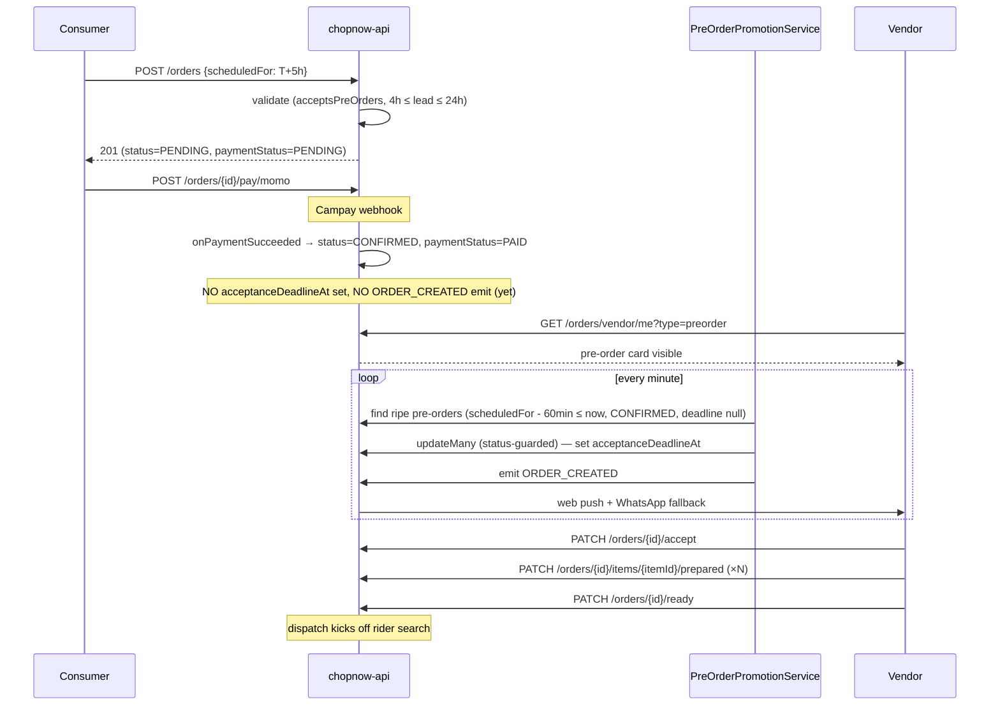

# Pre-orders

Same-day and day-ahead pre-orders for INFORMAL vendors (and any other vendor admin opts in). Lets the cook batch-prep ndolé, eru, poulet DG without guessing demand — consumers commit to a delivery time 4-24h ahead.

Tracks chopnow-api issue [#187](https://github.com/ChopNow-app/chopnow-api/issues/187).

## Mental model

Three rules govern the flow:

1. **Per-vendor opt-in**, gated by `Vendor.acceptsPreOrders` (boolean). INFORMAL vendors default to `true` at submission; admin can flip any vendor without code changes.
2. **Payment-locked, vendor-controlled cancellation**. Once a pre-order is paid, the consumer cannot cancel. Only the vendor can — and breaking an *accepted* commitment incurs a penalty.
3. **Acceptance fires when the vendor can act on it**. The 60-second decision countdown doesn't start at payment confirmation; it starts when a per-minute cron promotes the pre-order ~60 minutes before pickup. Same for dispatch.

## Lifecycle



## Validation rules (v1.1)

| Rule | Value | Source |
|---|---|---|
| Minimum lead time | **4 hours** from `now` | `PRE_ORDER_MIN_LEAD_HOURS` in `orders.service.ts` |
| Maximum lead time | **24 hours** from `now` | `PRE_ORDER_MAX_LEAD_HOURS` (v1.1) — was end-of-today in v1 |
| Promotion lead | **60 minutes** before `scheduledFor` | `PRE_ORDER_NOTIFICATION_LEAD_MINUTES` |
| Vendor must accept pre-orders | `Vendor.acceptsPreOrders === true` | per-vendor flag, default true for INFORMAL |
| Cancellation penalty | **10% of `totalXAF`** rounded down to 50 FCFA | `PRE_ORDER_PENALTY_RATE` + `_ROUND_TO_XAF` |

### Error codes returned by `POST /orders`

| HTTP | Code | Meaning |
|---|---|---|
| 400 | `pre_orders_not_accepted_by_this_vendor` | Vendor's flag is false |
| 400 | `pre_order_too_soon` | `scheduledFor < now + 4h` |
| 400 | `pre_order_too_far_in_future` | `scheduledFor > now + 24h` |

## Cancellation model

The user-facing rule: **once a pre-order is paid, only the vendor can cancel**, and a vendor who accepts then backs out pays a small penalty.

| State | Path | Consumer refund | Vendor penalty |
|---|---|---|---|
| Pre-order PAID, not yet accepted | `PATCH /orders/:id/refuse` (vendor) | ✅ | ❌ |
| Pre-order PAID, not yet accepted, vendor ignores | Auto-refuse cron (60s after promotion) | ✅ | ❌ |
| Pre-order ACCEPTED / IN_PREP | `PATCH /orders/:id/vendor-cancel-preorder` (vendor) | ✅ | ✅ VendorPenalty row |
| Pre-order READY_PICKUP+ | (no longer cancellable — in rider flow) | — | — |
| Consumer attempts cancel at any point | `PATCH /orders/:id/cancel` (consumer) | — | — — endpoint returns 409 `pre_order_consumer_cannot_cancel` |

### `VendorPenalty` ledger

```prisma
enum VendorPenaltyReason {
  PRE_ORDER_VENDOR_CANCEL_AFTER_ACCEPT
}

model VendorPenalty {
  id        String              @id @default(uuid())
  vendorId  String
  orderId   String              @unique   // one penalty per order; status guard prevents re-cancel
  reason    VendorPenaltyReason
  amountXAF Int                              // 10% of totalXAF rounded down to 50 FCFA
  createdAt DateTime            @default(now())
  settledAt DateTime?                        // Finance module (Epic 7) deducts from payout
}
```

Until the Finance module ships (Story 7.x), penalty rows are bookkeeping only — admin can review them but they don't yet deduct from MoMo payouts automatically. The `event:pre_order_refund_required` log surfaces orders that need manual Campay refund processing while Story 3.8 (Campay refund API) is pending.

## Vendor surface

### Dashboard

`/vendor` adds a new **"Pré-commandes"** section above "À décider", visible only when `acceptsPreOrders=true` AND at least one pre-order exists. Cards show relative time ("Auj. 14:30") and route to the same `/vendor/commande/[id]` (decision) or `/vendor/preparation/[id]` (post-acceptance) surfaces immediate orders use — no parallel UI track.

### Decision screen

Cron-triggered. `acceptanceDeadlineAt` is set 60 minutes before `scheduledFor`, so the 60-second decision countdown lands at `scheduledFor - 59min` ± a few seconds. Same UX as immediate orders from this point forward.

### Preparation screen

For pre-orders in `ACCEPTED` / `IN_PREP`, a red **"Annuler cette pré-commande"** button is rendered below the prep checklist. Tap → inline confirm panel that:

- Previews the penalty (mirrors backend: `floor(totalXAF * 0.10 / 50) * 50`)
- Takes an optional free-text reason (max 200 chars, surfaced in the refund-pending WhatsApp to the consumer)
- POSTs `PATCH /orders/:id/vendor-cancel-preorder`

Hidden on `READY_PICKUP` — by then the order is in the rider handover flow.

## Consumer surface

### Cart

When `vendor.acceptsPreOrders === true`, the cart renders a **"Maintenant / Plus tard"** toggle below the address picker. "Plus tard" opens a sub-toggle for **Aujourd'hui / Demain** + a 30-min slot grid. The grid is clamped to `[now+4h, now+24h]` AND to that day's boundary, so each tab shows only valid times.

Edge cases:

- Cart opened at 22:00 → today's tab has no valid slots (min-lead 4h pushes earliest into tomorrow) → today tab hidden, "Demain" is locked in.
- Cart opened at 03:00 → both tabs visible.

### Order tracking

`/orders/[id]` on a pre-order shows a green callout with "Livraison prévue : Aujourd'hui 14:30" (or "Demain"). The cancel button is **hidden entirely** rather than disabled-with-tooltip — it doesn't tease an action the consumer can't take.

## Admin surface

The `/admin` validation queue card for each pending vendor now includes a **Pré-commandes** toggle row below the KYC block:

- Green "Activé" / grey "Désactivé" pill
- Tap to flip — calls `PATCH /api/admin/vendors/:id/pre-orders`
- Idempotent server-side; double-taps are safe

INFORMAL vendors are pre-set to `true` at submission, so the toggle is mostly used to:

- Opt **out** an INFORMAL vendor whose kitchen workflow doesn't suit pre-orders
- Opt **in** a willing SEMI_FORMAL vendor (uncommon; admin override scenario)

## Structured telemetry events

| Event | Level | Fires from | Meaning |
|---|---|---|---|
| `pre_order_paid_awaiting_promotion` | info | `OrdersService.onPaymentSucceeded` | Pre-order payment confirmed; vendor notification deferred to cron |
| `pre_order_promoted` | info | `PreOrderPromotionService.sweep` | Cron promoted a pre-order to the vendor's decision queue |
| `pre_order_promotion_failed` | error | same | DB error during promotion (single row, batch continues) |
| `pre_order_vendor_cancelled_after_accept` | warn | `OrdersService.vendorCancelPreOrder` | Vendor cancelled an accepted pre-order; penalty recorded |
| `pre_order_refund_required` | warn | same | Order awaiting Campay refund (Story 3.8 pending) — manual ops worklist |
| `admin_vendor_preorders_toggled` | info | `AdminValidationService.setVendorPreOrders` | Admin flipped the per-vendor flag |

### Suggested dashboards

- Per-vendor cancel-after-accept rate — `event:pre_order_vendor_cancelled_after_accept` grouped by `vendorId`. Vendors with > 5% rate over a week need a check-in.
- Penalty ledger total — sum `amountXAF` from `pre_order_vendor_cancelled_after_accept` events per vendor (or query the `VendorPenalty` table directly).
- Refund worklist — `event:pre_order_refund_required` (manual processing until Story 3.8 is wired).

## API reference

| Endpoint | Auth | Body | Notes |
|---|---|---|---|
| `POST /api/orders` | consumer | `+ scheduledFor?: ISO 8601` | Backend validates flag + lead time; errors at top |
| `GET /api/orders/vendor/me?type=preorder` | vendor | — | `?type=immediate` (default) preserves today's flow |
| `PATCH /api/orders/:id/vendor-cancel-preorder` | vendor | `{ note?: string }` | Only valid in ACCEPTED/IN_PREP; creates VendorPenalty row |
| `PATCH /api/orders/:id/cancel` | consumer | — | 409 `pre_order_consumer_cannot_cancel` on pre-orders |
| `PATCH /api/admin/vendors/:id/pre-orders` | admin | `{ acceptsPreOrders: boolean }` | Idempotent; per-vendor opt-in toggle |

## Out of scope (v2+)

- **Recurring pre-orders** ("every Thursday lunch") — schema needs a new `RecurringOrder` model. Highest customer-retention value but most ambitious.
- **Multi-day T+N** (3-7 day window) — bump `PRE_ORDER_MAX_LEAD_HOURS` and add a date picker to the cart. Backend already supports it via the cap constant.
- **Vendor-specific cancellation cutoffs** — currently no cutoff at all (vendor can cancel up to ready-pickup). v2 may add a "no cancel within X hours of pickup" rule and a separate penalty tier for it.
- **Financial penalty settlement** — VendorPenalty rows are bookkeeping today; Epic 7 Finance module reads `settledAt` and nets unsettled rows against MoMo payouts.
- **PSP-direct payment** — once the platform integrates directly with MTN MoMo + Orange Money (post-aggregator, see [#180](https://github.com/ChopNow-app/chopnow-api/issues/180)), pre-orders can support delayed-capture flows (hold authorisation at order time, capture at pickup) for cleaner refund mechanics.
